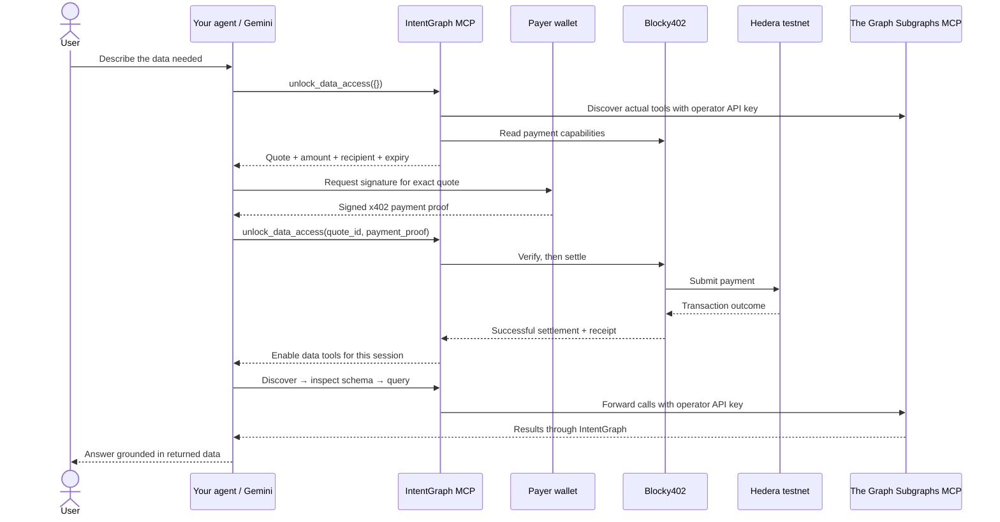

# IntentGraph


### From a question to on-chain data. One MCP connection.

**IntentGraph gives AI agents paid access to The Graph’s subgraphs through a verifiable Hedera payment flow.** Describe the data you need, let your agent unlock the toolkit, and follow the evidence from discovery to the final query result.

You do not need your own Graph API key. IntentGraph authenticates to The Graph on your behalf using the operator’s server-side key. Your agent brings the intent; The Graph provides indexed blockchain data; Hedera records the access payment.

**Current release:** Hedera testnet payments in native HBAR, a working MCP endpoint, and an interactive Gemini playground.

[Try the playground](#try-it-in-your-browser) · [Connect your agent](#connect-your-agent) · [Follow an example](#one-intent-through-the-entire-pipeline) · [Run locally](#run-your-own-instance)

---

## What you can do

- **Ask for blockchain data in natural language.** Your agent translates the request into discovery, schema inspection, and GraphQL calls.
- **Access The Graph without managing a Graph key.** The service operator supplies the upstream credentials.
- **Let your agent choose its access window.** Quick, Explore, and Standard packages pair shorter sessions with lower HBAR prices. One confirmed payment unlocks the selected allowance.
- **Inspect how an answer was produced.** The playground shows tool arguments, returned data, and a settlement receipt alongside the answer.
- **Use your preferred agent.** Connect an MCP-compatible client, or try the hosted Gemini demonstration in your browser.

IntentGraph is useful for developers exploring protocols, analysts inspecting indexed activity, and agent builders who need a clear path from a data request to paid tool access. Available data depends on the subgraphs discoverable through the upstream service, their schemas, and their indexing status.

## Two ways to use IntentGraph

| | Browser playground | Your own MCP agent |
|---|---|---|
| Where you start | A prompt box at `/playground` | Your agent’s chat or workflow |
| Who reasons about your request | The operator-configured Gemini model | Your chosen agent |
| Who pays for access | The operator’s shared demo wallet | Your agent’s Hedera testnet wallet |
| Graph API key required from you | No | No |
| Wallet setup required from you | No | Yes, including x402 signing support |
| What you can inspect | Live console, raw data, answer, receipt | Tool results and receipt through your MCP client |

The shared wallet sponsors **browser demonstrations only**. Connecting an external agent does not give it access to the demo wallet.

## Try it in your browser

1. Open the landing page and select **Playground**.
2. Enter an intent, or choose one of the starting prompts.
3. Select **Run the real flow**.
4. Watch the pipeline advance through **Connect → Pay → Discover → Schema → Query → Answer**.
5. Expand console entries to inspect the calls. Switch between **Answer** and **Raw data**, or open the payment receipt in HashScan.

The playground uses real services: Gemini chooses tools, the shared wallet signs an x402 payment, Blocky402 settles it on Hedera testnet, and The Graph returns query results. Console filters separate tools, payments, and data; the trace download lets you review a run afterward.

Your prompt and tool results are sent to Gemini. API keys, wallet private keys, and signed payment proofs stay on the server and are excluded from the public trace.

### Sample intents

| Intent | What the agent should investigate | Expected result shape |
|---|---|---|
| “Show the 5 latest Uniswap V3 swaps on Ethereum with amounts and token symbols.” | A matching deployment, its swap schema, token fields, and timestamps | A small swap list with clearly stated units |
| “Find active Aave subgraphs on Ethereum and query a small sample of lending data.” | Candidate deployments, activity hints, and supported lending entities | A deployment choice and a bounded lending-data sample |
| “Find Uniswap V3 pools on Ethereum and return the top 5 by TVL in USD, if the schema supports it.” | Pool fields, USD valuation fields, and available sort options | A ranked pool table, or an explanation of missing fields |
| “Explore the schema of an Ethereum Uniswap subgraph and explain which swap fields I can query.” | Discovery and schema inspection | A description grounded in the returned schema |

Be specific about the protocol, chain, version, time range, and result count. This helps the agent choose a relevant deployment and keep the response focused. A schema-only request can be useful without producing a GraphQL data query.

## How The Graph and Hedera work together

| Component | Role in your request |
|---|---|
| **Your agent / Gemini** | Interprets the intent, chooses tools, builds a query from the schema, and explains the returned data |
| **IntentGraph** | Issues the access quote, enforces payment and session limits, and forwards authorized calls |
| **The Graph Subgraphs MCP** | Exposes tools for subgraph discovery, deployment activity, schema inspection, and GraphQL execution |
| **Hedera testnet** | Records the native HBAR transfer used to purchase access |
| **x402 + Blocky402** | Defines the payment requirements and carries out verification and settlement of the signed payment |

The payment network and the queried blockchain are independent. For example, you can pay in HBAR on **Hedera testnet** to query an **Ethereum** subgraph. The payment is for IntentGraph access; it does not move assets on the blockchain you are querying.



In the browser playground, the server handles the wallet-signing and proof-submission steps for Gemini. The model never receives the private key or signed proof.

## One intent through the entire pipeline

> **Example intent:** “Show the 5 latest Uniswap V3 swaps on Ethereum with amounts and token symbols.”
>
> The examples below are illustrative, shortened, and use placeholders. They are not live market data or copy-ready payment credentials. Discovery, activity, and schema outputs are shown as readable summaries rather than exact upstream response schemas. Actual identifiers, schemas, receipts, and values appear in your run’s console.

### 1. Choose a package, connect and request access

**Your intent at this step:** Give the agent permission to discover the available data tools.

A fresh MCP session initially exposes only `unlock_data_access`. The agent chooses the cheapest suitable package and requests a quote. This example omits the selection and therefore uses Standard:

```json
{
  "name": "unlock_data_access",
  "arguments": {}
}
```

**Sample output — shortened quote:**

```json
{
  "status": "payment_required",
  "quote_id": "<quote UUID>",
  "expires_at": "<quote expiry in UTC>",
  "x402Version": 2,
  "accepts": [{
    "scheme": "exact",
    "network": "hedera:testnet",
    "amount": "1000000",
    "asset": "0.0.0",
    "payTo": "<operator receiving account>",
    "maxTimeoutSeconds": 120,
    "extra": { "feePayer": "<facilitator fee-payer account>" }
  }],
  "access": { "seconds": 3600, "queries": 100, "tool_calls": 500 }
}
```

`1000000` tinybars equals **0.01 HBAR**. The quote specifies the recipient and access allowance before signing. IntentGraph first checks that it can discover the upstream tool schemas; this does not guarantee that every later data query will succeed.

### 2. Sign the quoted payment

**Your intent at this step:** Pay the exact advertised amount to unlock access.

The wallet signs the quoted requirements locally. It does not independently submit the transfer. The agent then sends the signed proof back in the **same MCP session**:

```json
{
  "name": "unlock_data_access",
  "arguments": {
    "quote_id": "<same quote UUID>",
    "payment_proof": "<base64-encoded x402 v2 PaymentPayload>"
  }
}
```

**What you see in the playground:**

```text
x402 quote received
Shared wallet signed
unlock_data_access called with payment_proof: [REDACTED]
```

Browser visitors use the shared, faucet-funded demo wallet automatically. External agents need their own signing integration; a standard MCP connection alone does not supply a wallet.

### 3. Settle and unlock the real tools

**Your intent at this step:** Confirm payment before granting data access.

IntentGraph checks the quote and replay protection, then asks Blocky402 to verify and settle the payment. Only a successful settlement enables the actual registered data tools using `.enable()`. Those handles begin disabled with `.disable()` and are disabled again when access expires or a limit is reached.

**Sample output — shortened unlock result:**

```json
{
  "status": "unlocked",
  "settlement": {
    "success": true,
    "transaction": "<Hedera transaction ID>",
    "network": "hedera:testnet"
  },
  "expires_at": "<access expiry in UTC>",
  "tools": [
    "search_subgraphs_by_keyword",
    "get_deployment_30day_query_counts",
    "get_schema_by_ipfs_hash",
    "execute_query_by_ipfs_hash"
  ]
}
```

The tool list above is abbreviated. The client receives a tool-list update and can refresh `tools/list`. The playground displays the settlement receipt with a HashScan link. One visitor’s payment does not unlock another visitor’s session.

### 4. Discover a relevant subgraph

**Your intent at this step:** Find a deployment that matches Uniswap V3 on Ethereum.

```json
{
  "name": "search_subgraphs_by_keyword",
  "arguments": { "keyword": "Uniswap V3" }
}
```

The agent uses returned IPFS hashes to check deployment activity:

```json
{
  "name": "get_deployment_30day_query_counts",
  "arguments": { "ipfs_hashes": ["<IPFS hash returned by search>"] }
}
```

**Sample output — readable summary:**

```text
Candidate: a Uniswap V3 deployment matching Ethereum
Identifier: <IPFS hash from the search response>
Recent query activity: available as a ranking hint
Next action: inspect this deployment's schema
```

Recent query volume helps compare candidates. A zero count does not prove a deployment is unavailable: the playground agent still attempts schema inspection and a small query before concluding that data cannot be retrieved.

### 5. Inspect the schema before writing a query

**Your intent at this step:** Learn which fields exist and what their values mean.

```json
{
  "name": "get_schema_by_ipfs_hash",
  "arguments": { "ipfs_hash": "<selected IPFS hash>" }
}
```

**Sample output — readable summary:**

```text
Inspect the available swap entity and its fields.
Identify timestamp, amount, and token relationships.
Check token decimals and whether amounts use base units.
Confirm supported ordering and result-limit arguments.
```

Schemas differ across subgraphs. The agent must use the returned schema instead of assuming a universal swap format. The same applies to USD values, liquidity metrics, lending positions, and other protocol-specific fields.

### 6. Execute a bounded GraphQL query

**Your intent at this step:** Retrieve five relevant records from the selected deployment.

```json
{
  "name": "execute_query_by_ipfs_hash",
  "arguments": {
    "ipfs_hash": "<selected IPFS hash>",
    "query": "<GraphQL query built from the inspected schema, limited to 5 swaps>"
  }
}
```

The query string is intentionally a placeholder: a runnable query must use the exact fields and ordering options discovered in step 5.

**Sample output — illustrative data summary:**

```text
Records returned: 5 swaps
Example record:
  Timestamp: <timestamp returned by the subgraph>
  Input token: USDC, decimals: 6
  Input amount: 125000000 base units
  Output token: WETH, decimals: 18
  Output amount: 50000000000000000 base units
```

IntentGraph forwards the authorized call through The Graph’s Subgraphs MCP using the operator’s API key. The response comes from the selected subgraph. “Latest” is relative to that deployment’s indexed data and may lag the chain head.

### 7. Return an answer you can inspect

**Your intent at this step:** Understand the results without losing access to the underlying evidence.

**Sample final output — using the illustrative record above:**

```text
The selected Ethereum subgraph returned five recent Uniswap V3 swaps.
One swap exchanged 125 USDC for 0.05 WETH.

Amounts were converted from base units using the returned token decimals.
See Raw data for the source records and the console for the query.
```

If decimals are unavailable, amounts should be explicitly labeled as raw base units. If a tool fails or no usable data is found, the agent should explain the limitation rather than invent an answer. The playground distinguishes a response backed by a successful query from a response with no successful query yet.

## What access includes

The following table describes the Standard package for backward compatibility. Shorter packages are available below; always check the actual quote from the instance you use.

| Access term | Default |
|---|---|
| Payment | 0.01 HBAR on Hedera testnet |
| Quote validity | 2 minutes |
| Access duration | 60 minutes |
| GraphQL allowance | Up to 100 query attempts |
| Total tool allowance | Up to 500 data-tool calls |
| Scope | The MCP session that paid |

The fee is set by the IntentGraph operator and is not The Graph’s underlying query price. It purchases access, not a guaranteed answer. Dispatched upstream failures consume an attempt; invalid tool arguments do not. There are no automatic refunds.

Keep your MCP session ID. Terminating the session, losing its ID, or restarting the server ends access. If settlement is reported as uncertain, **do not submit another payment automatically**; retain the quote ID and contact the operator for reconciliation.

The browser demo has an additional shared budget: by default, 30 attempted runs per UTC day, one active run at a time, and at most one payment attempt per run. Each run has bounded model turns, tool calls, context size, and execution time. Stopping a run stops further work, while a payment already submitted is allowed to finish safely.


## Time-based dynamic access packages

IntentGraph now prices access by package. The agent selects a server-defined package before signing, and the quoted price stays fixed through settlement. There is no subscription, automatic renewal, or surprise price change during a paid session.

| Package | Default HBAR price | Access after settlement | Query attempts | Total tool calls | Quote validity |
|---|---:|---:|---:|---:|---:|
| Quick | 0.0025 | 5 minutes | 5 | 30 | 60 seconds |
| Explore | 0.005 | 15 minutes | 20 | 100 | 90 seconds |
| Standard | 0.01 | 60 minutes | 100 | 500 | 120 seconds |

**Quote validity** is the time allowed to submit the payment proof. **Access duration** begins only after successful settlement. Tools disable when time expires, a usage allowance is exhausted, or the session closes. An expired quote cannot be redeemed; request a new quote before signing. A pending quote can be replaced by choosing another package, invalidating the old quote. An already active pass is not upgraded or extended by calling unlock again.

In the playground, Gemini sees all packages in the unlock tool description and chooses the cheapest suitable one: Quick for a focused data lookup, Explore for broader discovery, Standard only when extended access is explicitly requested. The selected card is highlighted beside the exact price, quote deadline, and access expiry. The demo still ends its own MCP session after the answer and retains its five-minute run budget; buying longer access does not extend the browser agent's workflow. Extended sessions primarily benefit external MCP clients.

```json
{
  "name": "unlock_data_access",
  "arguments": { "package_id": "quick" }
}
```

The quote returns a `package` snapshot and `access` limits alongside its exact x402 `accepts` amount. Submit the same `quote_id` and signed `payment_proof` to settle. Do not send an amount chosen by the agent: only the server calculates pricing. Omitting `package_id` on a new session retains the existing Standard behavior.

No new Railway variables are required. `PRICE_TINYBARS` remains the Standard price; Quick costs one quarter and Explore one half, rounded up to whole tinybars. Existing `ACCESS_SECONDS`, `QUERY_LIMIT`, and `TOOL_CALL_LIMIT` settings cap every package. The wallet accepts only a configured package price, checks the actual balance, and the playground verifies that the returned amount matches the agent-selected package before signing. Payment receipts and volume statistics use the amount actually settled.
## Connect your agent

Use the instance’s `/mcp` endpoint. Replace `https://YOUR_HOST` with the deployed service URL. For a default local installation, use `http://localhost:3000`; the existing development instance may use a configured alternative port.

### Cursor

Add to `.cursor/mcp.json`:

```json
{
  "mcpServers": {
    "intentgraph": { "url": "https://YOUR_HOST/mcp" }
  }
}
```

### Claude Desktop

With Node.js installed, add to `claude_desktop_config.json`:

```json
{
  "mcpServers": {
    "intentgraph": {
      "command": "npx",
      "args": ["-y", "mcp-remote", "https://YOUR_HOST/mcp"]
    }
  }
}
```

### VS Code

Add to `.vscode/mcp.json`:

```json
{
  "servers": {
    "intentgraph": { "type": "http", "url": "https://YOUR_HOST/mcp" }
  }
}
```

Your client must preserve `Mcp-Session-Id` and support tool-list changes, or refresh `tools/list` after unlocking. The payment request is returned inside `unlock_data_access`, so MCP initialization remains available before payment.

### Bring a payment-capable wallet

External agents sign the quote with an x402-compatible Hedera testnet wallet. The repository includes a local helper:

1. Save the inner JSON quote from `unlock_data_access` as `quote.json`.
2. On the payer’s machine, configure `PAYER_ACCOUNT_ID`, `PAYER_PRIVATE_KEY`, `EXPECTED_PAY_TO`, and `MAX_PAYMENT_TINYBARS` in the wallet environment.
3. Run `npm run pay -- quote.json`.
4. Submit the resulting `{quote_id, payment_proof}` to `unlock_data_access` in the original session.

The helper checks expiry, recipient, amount ceiling, native HBAR, and testnet before signing. Never send a private key to an MCP tool. The operator-local `npm run mcp:stdio` entrypoint is also available; it is not a way to distribute the operator’s credentials to customers.

## Live activity and receipts

The landing page reports actual recorded activity:

- Settled payments and HBAR volume.
- Query attempts and successful query calls.
- Total tool calls and active paid HTTP sessions.
- Recent tool activity and seven days of query counts.

These counters come from the application’s persistent SQLite ledger through `/api/stats`, refreshed every ten seconds. They are not seeded demonstration numbers. Failed, pending, and uncertain settlements are excluded from the settled-payment count. A successful query counter reflects a successful tool response, not a guarantee of complete or current data.

Public statistics do not expose API keys, payment proofs, session IDs, payer IDs, or query text. The playground separately shows the shared demo wallet’s public address and balance, along with the receipt for your run.

## Run your own instance

### Prerequisites

- Node.js **22.16 or newer**.
- An operator Graph Gateway API key.
- A Hedera testnet account to receive payments.
- For the browser playground: a Gemini API key and a funded shared testnet wallet.

### Install and configure

```sh
npm ci
cp .env.example .env
```

On PowerShell, use `Copy-Item .env.example .env`. Do not overwrite an existing configured `.env`.

| Setting | What to configure |
|---|---|
| `GATEWAY_API_KEY` | Operator key for The Graph; never shared with visitors |
| `HEDERA_SELLER_ACCOUNT_ID` | Hedera testnet receiving account |
| `GEMINI_API_KEY` | Server-side key for the browser demonstration |
| `GEMINI_MODEL` | Demo model; defaults to `gemini-3.5-flash-lite` |
| `PUBLIC_URL` | Public base URL used in client installation snippets |
| `PORT` | Server port; defaults to `3000` |
| `ALLOWED_ORIGINS` | Allowed browser origins, including your actual site origin |
| `DATA_DIR` | Persistent directory for the ledger and shared wallet |
| `DEMO_DAILY_RUN_LIMIT` | Shared daily demo allowance; defaults to `30` |
| `DEMO_ENABLED` | Set to `false` to disable the browser demo |

See [.env.example](.env.example) for access-duration, query, tool-call, facilitator, and transport settings. Receiving payments does not require the seller’s private key. The separate demo payer wallet does require its own locally stored signing key.

### Fund the shared demo wallet

```sh
npm run wallet:setup
```

Fund the printed EVM address using the Hedera testnet faucet, complete its CAPTCHA, then activate the account:

```sh
npm run wallet:setup -- --activate
```

The wallet persists in `DATA_DIR/demo-wallet.json`, excluded from Git and public web assets. Activation completes the faucet-created account with a self-paid transaction transferring one tinybar to the configured receiving account. An optional `HEDERA_PAT` supports `npm run wallet:setup -- --fund --activate` through the faucet API.

Keep this file private and back it up securely. All browser demo visitors use the same funded wallet; their MCP access sessions remain separate.

### Start the application

```sh
npm run build
npm start
```

| Route | Purpose |
|---|---|
| `/` | Landing page, live activity, and connection instructions |
| `/playground` | Interactive Gemini demonstration |
| `/mcp` | Streamable HTTP MCP endpoint |
| `/api/stats` | Public usage statistics |
| `/api/playground/status` | Demo availability and public wallet status |

For development, run `npm run dev` and `npm run dev:web` in separate terminals. Vite proxies `/api` to port 3000 by default; update its proxy when using another backend port. Run all commands from the repository root.

### Deployment essentials

Run a single persistent Node service behind HTTPS. A static-only host cannot run the MCP, payment settlement, or Gemini backend.

```sh
# Configure .env and your public URL first.
docker compose up --build -d
```

Use persistent local storage outside cloud-sync folders. Preserve MCP session headers through the reverse proxy, allow long-lived connections, and disable buffering and caching for MCP and playground streams. Include the public origin in `ALLOWED_ORIGINS`. The provided Docker configuration uses a non-root process and a persistent volume; it has not been validated by running Docker in this Windows environment.

The application does not trust forwarded IP headers by default. Configure edge rate limiting for a public deployment. Multiple replicas require a redesigned shared ledger/session strategy; the current demo wallet and concurrency controls assume a single instance.

## Implementation and verification

| Area | Source |
|---|---|
| Gated tool registration and session allowances | [src/mcp.ts](src/mcp.ts) |
| Operator-authenticated Graph connection | [src/graph.ts](src/graph.ts) |
| x402 verification, settlement, and replay protection | [src/payments.ts](src/payments.ts) |
| Gemini tool loop and streamed run events | [src/playground.ts](src/playground.ts), [src/gemini.ts](src/gemini.ts) |
| Shared testnet wallet | [src/demo-wallet.ts](src/demo-wallet.ts) |
| Persistent payments and usage | [src/store.ts](src/store.ts) |
| HTTP API and session isolation | [src/app.ts](src/app.ts) |
| Landing page and playground | [web/](web/) |

```sh
npm run check
npm test
npm run build
npm audit --omit=peer
```

The automated suite covers gated tools, isolated sessions, quotas, replay prevention, failed and uncertain payments, HTTP behavior, and playground proof redaction. Tests use isolated fixtures and mock facilitator responses.

A separate live acceptance run verified the browser flow: **0.01 testnet HBAR settled through Blocky402, real Graph tools enabled, a schema inspected, and five Uniswap swaps returned.** This confirms the integration path; availability and results still depend on the configured upstream services and selected deployment.

### Gemini free-tier rate limits

The playground uses `gemini-3.5-flash-lite` and spaces Gemini request starts by at least 4.5 seconds, leaving a margin below a 15-request-per-minute quota. The same limiter persists across runs in the single server process. Only one demo runs at a time, and waiting remains cancellable.

Set `GEMINI_MODEL=gemini-3.5-flash-lite` in Railway and redeploy. No additional rate-limit variables are needed. There are no automatic retries or payment replays. If Gemini still returns a quota error, the run stops with a clear message and retains its existing results in the console. The original five-minute demo budget remains in place.

This controls this app's request frequency; token quotas, daily quotas, and other applications sharing the Google project can still cause limits. See [Gemini rate limits](https://ai.google.dev/gemini-api/docs/rate-limits).

### Playground pipeline enforcement

The demo now offers Gemini only the tools for its current stage: unlock, discovery, deployment activity, schema inspection, query, then answer. Query calls must use the same identifier and identifier type as a successfully inspected schema. Identical calls are blocked, activity counts remain advisory, and failed queries allow one correction before the answer stage. A successful data response (including an empty result) ends tool use. The final model turn is reserved for summarizing evidence or limitations instead of issuing more calls.

The answer describes subgraph-reported data, not independently verified prices or freshness. Implausible TVL values should be flagged rather than triggering unbounded rediscovery. These demo controls are implemented in `src/demo-workflow.ts`; external MCP agents retain their normal paid tool access.

